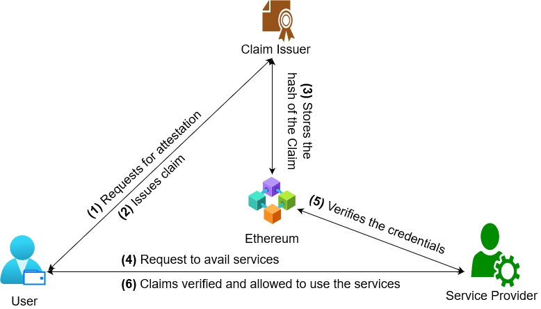
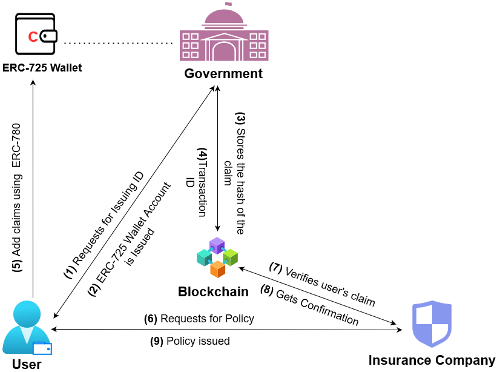

# Distributed Identity and Verifiable Claims Using Ethereum Standards 
      
   

## Abstract

Identity Management is an inevitable part of the proper delivery of schemes and services to individuals by the Government and Private Organizations. Identity Management encompasses the creation and maintenance of identity. It ensures that the right entity gains access to the right resources at the right time for verification. It also involves providing high security, privacy, productivity, and enhanced user experience. Rising incidents of data infringements and identity thefts in a centralized identity system are a growing concern. Blockchain-based identity solutions gained a competitive edge over the present centralized identity system due to the features of Self-Sovereign Identity (SSI) and Verifiable Claims (VC). In this paper, we investigate various blockchain-based identity solutions that are self-sovereign and can create VC. We have also analyzed and proposed to create a user-centric identity and claims using ERC-725 and ERC-780 Ethereum standards powered by IPFS for distributed data storage.

## Proposed Architecture

<b>Creation of user-centric identity using ERC-725</b>

<b>Creation of Verifiable Claim using ERC-780</b>

## Usecases

<b> Insurance Use-case using our proposed framework </b>

## Demo
[Click here](https://amrita-tifac-cyber-blockchain.github.io/Distributed-Identity-and-Verifiable-Claims-Using-Ethereum-Standards/UI/public/index.html) to access the webpage.

## Acknowledgement
We would like to acknowldge the support provided by **TIFAC-CORE in Cyber Security**, Amrita School of Engineering, Amrita Vishwa Vidyapeetham, Coimbatore, India in carrying out this work as part of "**18CY712 - Blockchain Technology**" Course. 

## References
 -  M. Kuperberg, ”Blockchain-Based Identity Management: A Survey From the Enterprise and Ecosystem Perspective,” in IEEE Transactions on Engineering Management, vol. 67, no. 4, pp. 1008-1027, Nov. 2020, doi: 10.1109/TEM.2019.2926471.
 -  Blockchain Identity Management: The Definitive Guide (2020 Update). https://tykn.tech/identity-management-blockchain. Last Accessed: 22 Jun 2020.
 -  Shashank, M. G., V. Sangeetha, and H. Shilpa. An Exploratory Study on SelfSovereign Identity Powered by the Blockchain Technology. No. 5484. EasyChair, 2021
 -  Dock. “About.” Dock, https://www.dock.io/about. Last Accessed: 30 Jan 2021
 -  Bloom. “What Is Bloom?” Bloom Knowledge Base, 8 Nov. 2019, https://faq.bloom.co/article/5-what-is-bloom.
 -  ERC725Alliance. “ERC725Alliance/ERC725.” GitHub, https://github.com/ERC725Alliance/erc725/blob/master/docs/ERC-725.md. Last Accessed: 27 Jan 2021
 -  Thorstensson, Joel. “ERC780 — an Open Identity and Claims Protocol for Ethereum.” Medium, 19 Oct. 2020, https://medium.com/uport/erc1056-erc780-an-open-identity-and-claims- protocol-for-ethereum-aef7207bc744
 -  Panait AE., Olimid R.F., Stefanescu A. (2020) Analysis of uPort Open, an Identity Management Blockchain-Based Solution. In: Gritzalis S., Weippl E.R., Kotsis G.,
   Tjoa A.M., Khalil I. (eds) Trust, Privacy and Security in Digital Business. TrustBus 2020. Lecture Notes in Computer Science, vol 12395. Springer, Cham.    https://doi.org/10.1007/978-3-030-58986-8_1
 - “IPFS Documentation.” IPFS Docs, 31 Aug. 2020, https://docs.ipfs.io

## Publication
Thomas A.M., Ramaguru R., Sethumadhavan M. (2022) Distributed Identity and Verifiable Claims Using Ethereum Standards. In: Ranganathan G., Fernando X., Shi F. (eds) Inventive Communication and Computational Technologies. Lecture Notes in Networks and Systems, vol 311. Springer, Singapore. [https://doi.org/10.1007/978-981-16-5529-6_48](https://doi.org/10.1007/978-981-16-5529-6_48)
